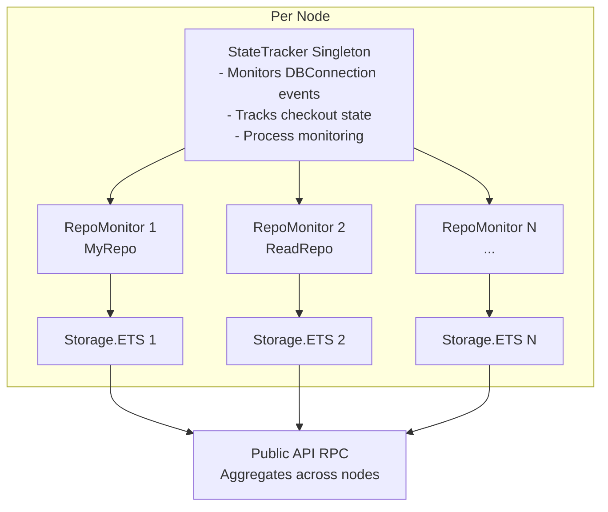

# EctoPoolInspector

## WARNING: EXPERIMENTAL - DO NOT USE IN PRODUCTION

This library is completely untested in real-world scenarios and may contain bugs that could impact your database connections. Use at your own risk. Not recommended for production use.

## Overview

EctoPoolInspector provides real-time visibility into Ecto connection pool usage in production Elixir applications. When database connection pools become exhausted, this library captures point-in-time snapshots showing which processes hold connections, their stack traces, hold durations, and application context.

The library is cluster-aware, providing aggregated views across all nodes.

## Features

- Real-time connection tracking via DBConnection telemetry
- Automatic snapshot capture based on configurable triggers (pool saturation, queue time)
- Configurable stack trace sampling
- Cluster-aware snapshot aggregation
- Context detection for Phoenix requests, Oban jobs, Broadway processors, GenServer calls, and Tasks
- Nested transaction depth tracking
- Rate limiting and configurable sampling

## Installation

Add `ecto_pool_inspector` to your list of dependencies in `mix.exs`:

```elixir
def deps do
  [
    {:ecto_pool_inspector, "~> 0.1.0"}
  ]
end
```

## Configuration

Configure in your `config/config.exs` or `config/runtime.exs`:

```elixir
config :ecto_pool_inspector,
  repos: [
    %{
      # The Ecto repo to monitor
      repo: MyApp.Repo,

      # Application name for telemetry events (required)
      app_name: :my_app,

      # Trigger conditions for automatic snapshots
      triggers: [
        {:pool_saturation, 0.8},  # Trigger at 80% pool usage
        {:queue_time, :p95, 200, :millisecond}  # Trigger on high queue time
      ],

      # Stack trace sampling configuration
      capture_stack_traces: :sample,  # :all | :none | :sample
      stack_trace_sample_rate: 0.1,   # Sample 10% when :sample mode
      stack_trace_timeout: 100,        # ms per stack capture
      stack_trace_concurrency: 10,     # Max concurrent captures

      # Snapshot storage configuration
      max_snapshots: 50,  # Keep last 50 snapshots per node

      # Monitoring intervals
      saturation_poll_interval: 10_000,  # Check saturation every 10s
      snapshot_interval: 60_000,         # Min time between auto snapshots

      # Pool configuration (if not in repo config)
      pool_size: 10
    }
  ]
```

### Multiple Repos

You can monitor multiple repos by adding multiple configurations:

```elixir
config :ecto_pool_inspector,
  repos: [
    %{
      repo: MyApp.Repo,
      app_name: :my_app,
      triggers: [{:pool_saturation, 0.8}],
      capture_stack_traces: :sample,
      pool_size: 10
    },
    %{
      repo: MyApp.ReadReplica,
      app_name: :my_app,
      triggers: [{:pool_saturation, 0.9}],  # Higher threshold for read replica
      capture_stack_traces: :none,  # No stack traces for read replica
      pool_size: 20
    }
  ]
```

## Setup

Add to your application supervision tree:

```elixir
defmodule MyApp.Application do
  use Application

  def start(_type, _args) do
    children = [
      MyApp.Repo,
      {EctoPoolInspector, []},  # Must come AFTER repos
      # ... other children
    ]

    Supervisor.start_link(children, strategy: :one_for_one)
  end
end
```

## Usage

### Manual Snapshot Capture

```elixir
# Capture snapshot on all nodes
EctoPoolInspector.capture_snapshot(MyApp.Repo, :all, :manual_debug)

# Capture on local node only (faster)
EctoPoolInspector.capture_snapshot(MyApp.Repo, :local, :investigating_issue)

# Capture on specific nodes
nodes = [:"app@prod-1", :"app@prod-2"]
EctoPoolInspector.capture_snapshot(MyApp.Repo, nodes, :targeted_debug)
```

### Viewing Snapshots

```elixir
# Get latest snapshot from all nodes
EctoPoolInspector.latest_snapshot(MyApp.Repo, :all)
|> EctoPoolInspector.format_snapshot()

# List recent snapshots
EctoPoolInspector.list_snapshots(MyApp.Repo, :all, limit: 5)
```

### Example Output

```
Snapshot at 2025-10-29 03:45:00.123456Z
Node: prod@app-1
Reason: pool_saturation
Pool Size: 10
Total Connections: 8
Sampled Connections: 2

Connection Details:

PID: #PID<0.1234.0>
Held For: 5234ms
Depth: 1
Context: Phoenix Request
Initial Call: {:cowboy_stream_h, :request_process, 3}

Stack Trace:
lib/my_app/slow_query.ex:45: MyApp.SlowQuery.fetch_data/1
lib/my_app_web/controllers/reports_controller.ex:23: MyApp.ReportsController.index/2
...
```

## Deployment Strategy (If You Ignore The Warning Above)

### Phase 1: Passive Monitoring

Start with minimal overhead:

```elixir
config :ecto_pool_inspector,
  repos: [
    %{
      repo: MyApp.Repo,
      app_name: :my_app,
      capture_stack_traces: :none,  # Just counts
      saturation_poll_interval: 30_000,  # Low frequency
      triggers: [
        {:pool_saturation, 0.95}  # High threshold
      ]
    }
  ]
```

### Phase 2: Selective Stack Traces

After validating Phase 1:

```elixir
capture_stack_traces: :sample,
stack_trace_sample_rate: 0.05,  # 5% sampling
triggers: [
  {:pool_saturation, 0.85}  # Lower threshold
]
```

### Phase 3: Full Production

```elixir
capture_stack_traces: :sample,
stack_trace_sample_rate: 0.1,
triggers: [
  {:pool_saturation, 0.8},
  {:queue_time, :p95, 200, :millisecond}
]
```

## Testing

### Simulating Pool Exhaustion

The library includes test helpers for simulating pool exhaustion:

```elixir
defmodule MyApp.PoolTest do
  use ExUnit.Case

  alias EctoPoolInspector.TestHelper

  test "captures snapshot when pool is exhausted" do
    # Exhaust the pool
    tasks = TestHelper.exhaust_pool(MyApp.Repo, 8)

    # Capture snapshot
    {:ok, snapshot} = EctoPoolInspector.capture_snapshot(MyApp.Repo, :local, :test)

    # Verify snapshot shows connections
    assert snapshot.total_connections == 8

    # Clean up
    TestHelper.cleanup_tasks(tasks)
  end
end
```

### Alternative Testing Approach

```elixir
# Using transactions instead of direct checkout
tasks = TestHelper.exhaust_pool_with_transactions(MyApp.Repo, 8)
# ... perform tests ...
TestHelper.cleanup_tasks(tasks)
```

## Monitoring the Monitor

Subscribe to telemetry events to monitor the inspector itself:

```elixir
:telemetry.attach(
  "log-inspector-events",
  [:ecto_pool_inspector, :snapshot, :captured],
  fn _event, measurements, metadata, _config ->
    Logger.info("""
    Pool snapshot captured
    Repo: #{inspect(metadata.repo)}
    Reason: #{metadata.reason}
    Connections: #{measurements.connection_count}
    """)
  end,
  nil
)
```

## Architecture



## Design Principles

1. Built on DBConnection telemetry events
2. Cluster-aware snapshot aggregation
3. Rate limiting and configurable sampling to minimize overhead

## Performance Characteristics

- StateTracker Memory: O(n) where n = active connections
- Checkout/Checkin: O(1) with counter cache
- Pool Saturation Check: O(1) with counter cache
- Snapshot Capture: O(m) where m = sampled connections
- Telemetry Overhead: Async cast per query

## Known Limitations

1. Only works with pools that emit DBConnection telemetry
2. Requires at least one query to discover repo→pool mapping
3. Small window where connections might be missed during capture
4. Advanced DBConnection ownership transfer not tracked (rare edge case)
5. Completely untested with real workloads

## License

MIT
